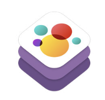
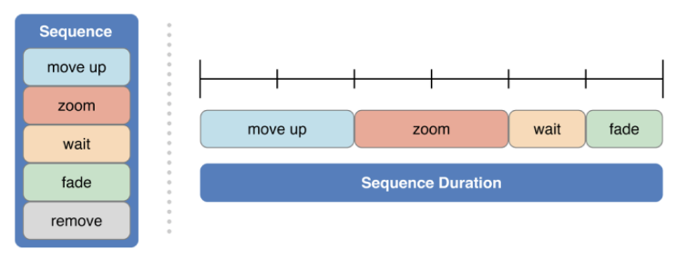
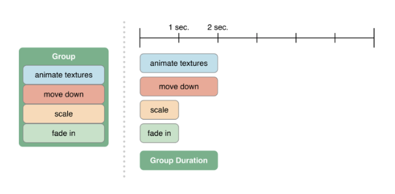
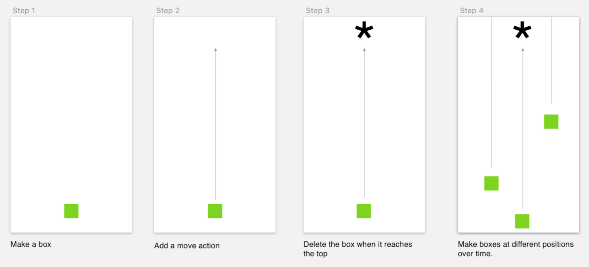

<!-- Run this slideshow via the following command: -->
<!-- reveal-md README.md -w -->

<!-- .slide: class="header" -->
# Introduction to SpriteKit

## [Slides](https://make-school-courses.github.io/MOB-1.1-Introduction-to-Swift/Slides/05-Introduction-to-SpriteKit/README.html ':ignore')

<!-- > -->

## Agenda

- Quick check-in
- What is SpriteKit
- Creating our first sprite
- Animations with Actions
- Break
- Starting our first game

<!-- > -->

## Check in

- Variables & constants
- Types & optionals
- Functions
- Classes, Structs & Enums
- Conditionals & Control flow (loops and switch statements)

**1 min** Think about one thing that's not 100% clear to you, regarding any of these topics.<br>
**5 min** Get in groups of 2 or 3 and share your doubts, see if you can get them answered by your classmates.<br>
**1 min** Only if no one in the group can answer a doubt, write it down. And give it to the instructor.

<!-- > -->

## Learning Objectives
By the end of this lesson, we should be able to:

- Setup an Xcode Game Project
- Use SpriteKit to build and run a simple project
- Learn how to use SKActions & SKNodes
- Create a simple game with help from starter code

<!-- > -->

## What is SpriteKit



- SpriteKit is a 2D game engine.
- Developed by Apple.
- Build on top of openGL.

Let’s you create high-performance, battery-efficient 2D games.

[Game Examples](http://mammothinteractive.com/examples-of-games-made-in-ios-spritekit/)

<!-- > -->

## Nodes (Sprites)

Nodes are the building blocks of SpriteKit.

A **node** is an object that can be put inside a scene.

Nodes in SpriteKit are commonly referred to as **sprites**

`SKNode` is the base class of all nodes.

All onscreen assets will be an `SKNode` or a subclass of it.

<!-- v -->

Example subclasses of `SKNode`:
- `SKScene` - an object that organizes all of the active SpriteKit content.
- `SKShapeNode` - renders a shape defined by a Core Graphics path
- `SKVideo` - displays video content
- `SKLabel` - displays a text label

<!-- v -->

### Node Properties

- `position` (CGPoint)
- `xScale` (CGFloat): representing the horizontal scale of a node
- `yScale` (CGFloat): similar to xScale but it acts in the vertical direction instead
- `alpha` (CGFloat): representing the node's transparency
- `hidden` (Bool): value determining whether or not the node should be visible
- `zRotation` (CGFloat): representing the angle, in radians, that the node should be rotated
- `zPosition` (CGFloat): used to determine which nodes should be displayed on top of other nodes in the scene

<aside class="notes">
SpriteKit offers many different node types, but they all share a common set of key properties inherited from `SKNode`.

A few of the most important properties of `SKNode` and its subclasses that you can manipulate.

About the types: In Swift, CGFloat is a struct wrapper around either Float on 32-bit architectures or Double on 64-bit ones. CG comes from Core Graphics (C-based graphics API on iOS)

https://code.tutsplus.com/tutorials/spritekit-from-scratch-fundamentals--cms-26326
</aside>

<!-- v -->

#### SKSpriteNode

The most common `SKNode` subclass that you will use is the `SKSpriteNode` class.

An `SKSpriteNode` is a type of node that can display either a colored rectangle, or an image.

<!-- v -->

#### SKScene
An instance of the `SKScene` class represents an active scene of content in SpriteKit.

A scene is the **root node** in a tree of SpriteKit nodes. This tree of nodes provides content that the scene animates and renders for display.

<!-- v -->

#### Positioning

The position of a sprite is controlled by its `position` property, which is a CGPoint (a simple struct that has two properties of its own: x and y).

```Swift  
  public struct CGPoint {
    public var x: CGFloat
    public var y: CGFloat
    // ...
  }
```

<!-- > -->

## Creating A Sprite

To create a sprite and display it to your users:

1. create an instance of `SKSpriteNode`

2. configure its `size` and `position` properties

3. add it to an `SKScene` object

Sprites are not visible unless they are inside an `SKScene` object, which means you need to add them as children of the scene itself by calling the `addChild(_:)` method (which comes with any `SKNode` object) on the `SKScene` object in which you want your sprite to appear.

<!-- For any nodes that you want in your scene, you need to add them as children of the scene itself using the `addChild(_:)` method which comes with any `SKNode` object. -->

<!-- v -->

#### Simple Example: Creating a Sprite

```swift  
// create sprite
  let myCoolSprite = SKSpriteNode(color: SKColor.red,
                          size: CGSize(width: 64, height: 64))

  // set sprite's position                        
  myCoolSprite.position = CGPoint(x: 100, y: 100)

  // add sprite as a child of a scene
  myScene.addChild(myCoolSprite)
```

<aside class="notes">
Example illustrates creation of a simple, colored rectangle sprite. All you need to create it is to provide the desired size and color of the rectangle and then add it as a child to the scene you want

Assume that the `myScene` object is an instance of `SKScene` previously declared outside of the code snippet shown.
</aside>

<!-- > -->

## Warm up

Create a simple sprite in the middle of the screen in a new Xcode project.

[Empty Starter project](https://github.com/Product-College-Labs/Game-Starter-Empty/tree/master)

<!-- > -->

## SKAction

`SKAction` is a powerful class used to bring nodes to life.

You can use `SKAction` objects to make *any* node in the scene perform an action. An action is something that changes one or more properties &mdash; like position, size, transparency, color, etc. &mdash; of *any* node in your scene &mdash; including the scene node itself.

<!-- v -->

### How to Implement

To apply an action to a node, you need to:

1. Create an instance of `SKAction`
2. Run it by calling one of the built-in `run(_:)` functions found on the node itself, passing in the action instance just created

<!-- v -->

__*Creating Actions*__

To create a SpriteKit action, call one of the many built-in static constructors (factory methods) of the `SKAction` class.

In this example, we use the `moveBy(x:y:duration:)` function built-in to `SKAction` to create an action which will make a sprite move `2` units along the x-axis and `3` units along the y axis in `1` second:

```Swift  
  let simpleTwoByThreeAction = SKAction.moveByX(2, y: 3, duration: 1)
```

<!-- v -->

__*Running Actions*__

Once you've created your desired action, you can run it on *any* `SKNode` object by invoking one of the node object's various `run(_:)` functions:

```Swift  
  myNode.run(simpleTwoByThreeAction)
```

And, if you want to apply the same action to multiple nodes, you can create your `SKAction` once, then call a `run(_:)` method on each of the several nodes for which you would like to perform the same action.

<!-- > -->

## Move Actions
There are several methods on `SKAction` that allow you to easily create an action that moves a node relative to its current position.

The simplest is [`move(to:duration:)`](https://developer.apple.com/documentation/spritekit/skaction/1417768-move), which Creates an action that moves a node to a new position:

```Swift  
  class func move(to location: CGPoint,
         duration: TimeInterval) -> SKAction
```

<!-- v -->

Example:

```Swift  
  let newPosition = CGPoint(x: 100, y: 100)
  let moveBottomLeftAction = SKAction.move(to: newPosition, duration:3.0)
  node.run(moveBottomLeftAction)
```

<!-- v -->

## Combining actions



<!-- v -->



<!-- v -->


<!-- > -->

## Activity


[Starter Code](https://github.com/Make-School-Labs/Animations-starter)

<aside class="notes">
In pairs, code the following animations using the sprite you created earlier. Use group, sequence, repeat, move and fade actions.
</aside>

<!-- > -->

## Starting our first game


<!-- v -->



[Starter Code](https://github.com/Make-School-Labs/PopTheBubble-starter)

<!-- > -->

<!--
## In Class Activities

Using what you already know, complete each step in the image to build a grid. Try using loops for the final result.


-->

## After Class

- Complete today's activities.
- Continue tutorial: [Sushi Neko](https://www.makeschool.com/academy/track/learn-to-clone-timberman-with-spritekit-and-swift-4)
- Review the content of the course so far for a small quiz next class.

<!-- > -->

## Additional Resources
- [Article - Quick Intro to SpriteKit](https://hackernoon.com/swift-spritekit-basics-94b1798ab639)
- [A more detailed Explanation of SpriteKit](https://code.tutsplus.com/tutorials/introducing-spritekit--cms-28648)
