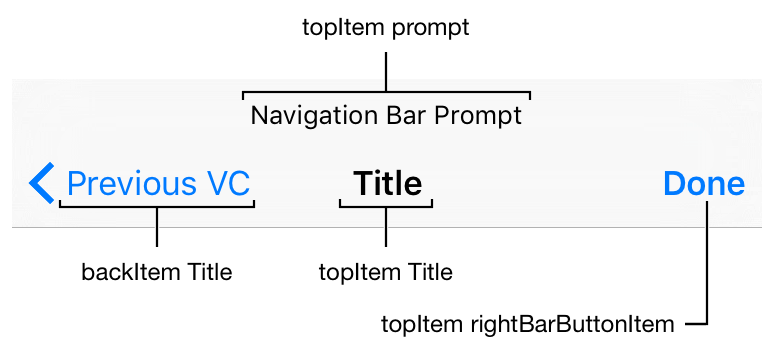

<!-- Run this slideshow via the following command: -->
<!-- reveal-md README.md -w -->

<!-- .slide: class="header" -->
# Navigation basics

## [Slides](https://make-school-courses.github.io/MOB-1.1-Introduction-to-Swift/Slides/12-Basic-Navigation/README.html ':ignore')

<!-- > -->

## Resources

- [Adobe XD](https://www.adobe.com/products/xd/details.html)
- [Sketch](https://www.sketch.com)
- [icons8](https://icons8.com)
- [The Noun Project](http://thenounproject.com)
- [Make App Icon](https://makeappicon.com)

<!-- > -->

## Agenda

- UINavigationController
- Segues
- Present vs Push
- Unwind segues
- Programmatic approach

<!-- > -->

## UINavigationController

A container view controller that defines a **stack-based** scheme for navigating hierarchical content.

- Only one child view controller is visible at a time
- Manages child view controllers using an ordered array, known as the **navigation stack**
- The first view controller in the array is the **root view controller** and represents the bottom of the stack

<!-- > -->


<aside class="notes">
Selecting an item in the view controller pushes a new view controller onscreen using an animation, thereby hiding the previous view controller.

Tapping the back button in the navigation bar at the top of the interface removes the top view controller, revealing the view controller underneath.
</aside>

<!-- > -->

## Navigation components


<aside class="notes">
The navigation controller also manages the navigation bar at the top of the interface and an optional toolbar at the bottom of the interface.
</aside>

<!-- > -->

## Navigation bar



<aside class="notes">
Commonly used within a navigation controller. The UINavigationController object creates, displays, and manages the navigation bar, and uses attributes of the view controllers you add to control the content displayed in the navigation bar.
</aside>

<!-- > -->

## Storyboard & Segues

A segue defines a transition between two view controllers in the storyboard.


<aside class="notes">
The starting point of a segue is the button, table row, or gesture recognizer that initiates the segue. The end point of a segue is the view controller you want to display.
</aside>

<!-- > -->

<iframe src="https://youtube.com/embed/Hnrz8ZTaP4s" data-autoplay  width="700" height="500"></iframe>

<!-- > -->

## Unwind segue

1. Choose the view controller that should appear onscreen at the end of an unwind segue.
2. Define an unwind action method on the view controller you chose.
  `@IBAction func unwindToVC1(segue:UIStoryboardSegue)`
3. Navigate to the view controller that initiates the unwind action.
4. Control-click the button (or other object) that should initiate the unwind segue. This element should be in the view controller you want to dismiss.
5. Drag to the Exit object at the top of the view controller scene.
6. Select your unwind action method from the relationship panel.

<!-- > -->

## Rock Paper Scissors

[Starter Project](https://github.com/amelinagzz/RPS/tree/master/RockPaperScissors)

<!-- > -->

## Programmatic approach

```swift
// Creates a VC from a storyboard file
let storyboard = UIStoryboard(name: "Main", bundle: nil)
let controller = storyboard.instantiateViewController(withIdentifier: "CharacterVC") as! PlayerViewController
```

<!-- v -->

```swift
// Push view controller
self.navigationController?.pushViewController(controller, animated: true)
```

Same result as using a segue with detail transition

<!-- v -->

```swift
// Present view controller
self.navigationController?.present(controller, animated: true, completion: nil)
```

Same result as using a segue with modal transition

<!-- v -->

```swift
self.navigationController?.popViewController(animated: true)
```
Same result as using a an unwind segue after a push.

<!-- v -->

```swift
self.navigationController?.dismiss(animated: true, completion: nil)
```
Same result as using a an unwind segue after a present.

<!-- > -->

## RPG Practice

[Starter Project](https://github.com/Make-School-Labs/RPGGame-starter)

Useful link for the activity: [Navigation done programmatically](https://medium.com/@felicity.johnson.mail/pushing-popping-dismissing-viewcontrollers-a30e98731df5)

<!-- > -->

## A note on Autolayout

The starter project we used today, had all the elements on the screen already set up. Every UI element had a frame (origin in x, origin in y, width and height). This was done in the storyboard using Autolayout and constraints.

Use the project to explore how the constraints were set up to get familiar with them.

<!-- > -->

## After Class

You will need to know the basic concepts on Autolayout for your final project. Autolayout is how we can set up the views in our apps and position them using a set of rules called **constraints**.

These two videos go over the basics and show you how to get started.

- [Autolayout introduction](https://www.youtube.com/watch?v=qb05nLPYKz8)
- [Autolayout & Constraints](https://www.youtube.com/watch?v=m_0_XQEfrGQ)

<!-- > -->

## Additional Resources

- [UINavigationController Apple Docs](https://developer.apple.com/documentation/uikit/uinavigationcontroller)
- [UINavigationBar Apple Docs](https://developer.apple.com/documentation/uikit/uinavigationbar)
- [Segues](https://developer.apple.com/library/archive/featuredarticles/ViewControllerPGforiPhoneOS/UsingSegues.html)
- [Creating unwind segues](https://medium.com/@mimicatcodes/create-unwind-segues-in-swift-3-8793f7d23c6f)
- [More on unwind segues](https://spin.atomicobject.com/2014/10/25/ios-unwind-segues/)
- [How to know present or push was used](https://stackoverflow.com/questions/23620276/check-if-view-controller-is-presented-modally-or-pushed-on-a-navigation-stack_)
